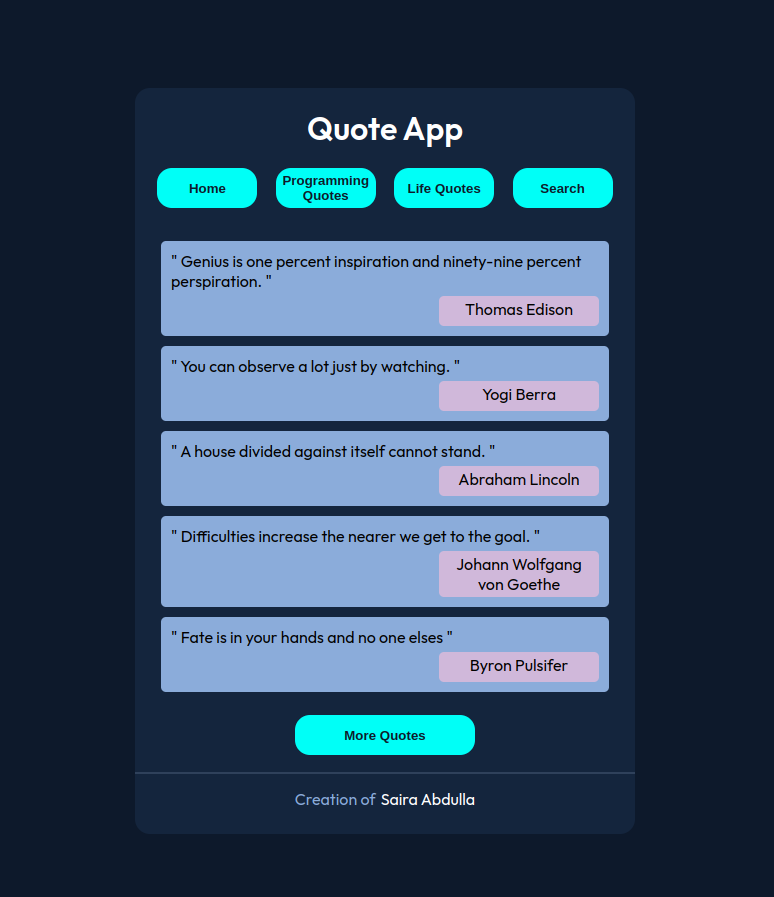

### QUOTE APP



### Description :
Quote lovers Assemble!!! Here is the collection of all the quotes you need. This app gives you quotes of different categories like Life, Love, programming etc. You can search for your favourite ones among this large collection.

### Link to project: https://myquoteapp.netlify.app/

### How It's Made:
Tech used: Vue JS, SCSS.

I have finally put my VUE JS skills into practice with this app. I enjoyed building components and then finally bringing them together to build the app. Styling is done using SCSS which gives so many added features when compared to just CSS, like, nesting, mixins, functions etc.

### Optimizations
Options to add and delete quotes could be given

### Lessons Learned:
Building an app using VUE.

## Project setup
```
npm install
```

### Compiles and hot-reloads for development
```
npm run serve
```

### Compiles and minifies for production
```
npm run build
```

### Customize configuration
See [Configuration Reference](https://cli.vuejs.org/config/).
